# 🛒 Punjab Cash & Carry – Complete OLTP to OLAP Data Architecture
## 📋 Executive Overview
Punjab Cash & Carry operates 30+ branches across Pakistan with 60+ product categories and processes thousands of daily transactions. This comprehensive documentation outlines the complete journey from operational POS systems to analytical data infrastructure.

## 🏢 Business Foundation
Core Business Operations
Punjab Cash & Carry operates as a retail chain with multiple branches across major Pakistani cities. Daily operations involve complex inventory management, customer transactions, and supplier relationships.

## Operational Workflow:
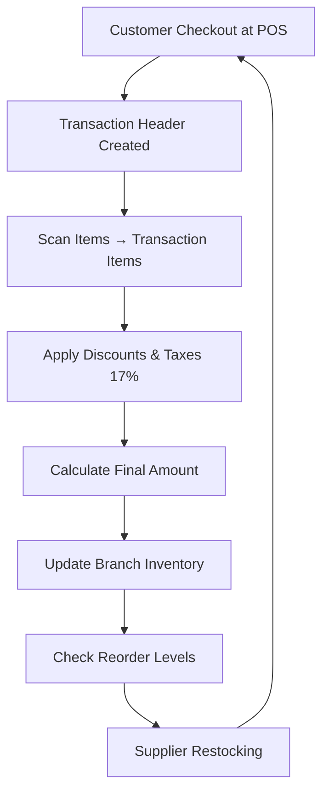
```mermaid
flowchart TD
    A[Customer Checkout at POS] --> B[Transaction Header Created]
    B --> C[Scan Items → Transaction Items]
    C --> D[Apply Discounts & Taxes 17%]
    D --> E[Calculate Final Amount]
    E --> F[Update Branch Inventory]
    F --> G[Check Reorder Levels]
    G --> H[Supplier Restocking]
    H --> A
```

## Branch Network Distribution

| City         | Branches | Key Locations                                  |
|--------------|----------|------------------------------------------------|
| Islamabad    | 15       | G-9 Markaz, DHA, Bahria Town, PWD, Korang Town |
| Rawalpindi   | 10       | Morgah, Satellite Town, Askari-14, Westridge   |
| Lahore       | 2        | Askari 10, PCC Manawan                        |
| Taxila       | 2        | Main GT Road, PCC Taxila                      |
| Other        | 1        | Maxmart Sector Area 21                        |


## Product Portfolio
### 60+ Categories with Realistic Inventory:

| Category           | Subcategory               | Number of Items |
|--------------------|---------------------------|-----------------|
| **Food & Beverages** | Dairy & Milk              | 79              |
|                    | Tea                       | 89              |
|                    | Spices & Herbs            | 265             |
|                    | Rice & Pulses             | 32              |
| **Personal Care**   | Hair Care                 | 491             |
|                    | Skin Care                 | 137             |
|                    | Fragrances & Perfumes     | 269             |
| **Household**       | Laundry                   | 115             |
|                    | Kitchen Cleaners          | 138             |
|                    | House Essentials          | 194             |
| **Baby Care**       | Baby Food                 | 19              |
|                    | Baby Milk Powder          | 68              |
|                    | Diapers & Wipes           | 69              |
| **Additional Categories** | Stationery             | N/A             |
|                    | Electronics               | N/A             |
|                    | Home Appliances           | N/A             |
|                    | Automotive                | N/A             |


##🗄️ OLTP POS Database Design
### Entity Relationship Diagram

```mermaid
erDiagram
    BRANCHES {
        string branch_id PK
        string branch_name
        string city
        string address
        date opening_date
        string branch_type
        decimal size_sqft
    }
    
    PRODUCTS {
        string product_id PK
        string product_name
        string category
        string subcategory
        string brand
        decimal unit_price
        decimal cost_price
        string unit_of_measure
        decimal weight_volume
        string manufacturer
        string barcode
    }
    
    CUSTOMERS {
        string customer_id PK
        string customer_name
        string phone_number
        string email
        string customer_type
        date registration_date
        string loyalty_tier
    }
    
    SUPPLIERS {
        string supplier_id PK
        string supplier_name
        string contact_person
        string phone
        string email
        string address
        string reliability_rating
    }
    
    TRANSACTIONS {
        string transaction_id PK
        datetime transaction_date
        string branch_id FK
        string customer_id FK
        decimal total_amount
        string payment_method
        decimal tax_amount
        decimal discount_amount
    }
    
    TRANSACTION_ITEMS {
        string transaction_id FK
        string product_id FK
        int quantity
        decimal unit_price
        decimal item_total
        decimal discount_percentage
    }
    
    INVENTORY {
        string branch_id FK
        string product_id FK
        int current_stock
        int reorder_level
        int max_stock
        date last_restocked
        string supplier_id FK
    }

    BRANCHES ||--o{ INVENTORY : "has"
    BRANCHES ||--o{ TRANSACTIONS : "records"
    PRODUCTS ||--o{ INVENTORY : "stocked"
    PRODUCTS ||--o{ TRANSACTION_ITEMS : "sold_in"
    CUSTOMERS ||--o{ TRANSACTIONS : "makes"
    SUPPLIERS ||--o{ INVENTORY : "supplies"
    TRANSACTIONS ||--o{ TRANSACTION_ITEMS : "contains"
  ```

## Table Specifications
| Table            | Purpose              | Key Fields                             |
|------------------|----------------------|----------------------------------------|
| **Branches**     | Store master data    | branch_type, size_sqft, opening_date  |
| **Products**     | Product catalog      | category, brand, cost_price, unit_price|
| **Customers**    | Shopper profiles     | loyalty_tier, registration_date       |
| **Suppliers**    | Vendor management    | reliability_rating, contact_info      |
| **Transactions** | POS receipts         | payment_method, total_amount, tax_amount |
| **Transaction Items** | Line-level details | quantity, unit_price, discount_percentage |
| **Inventory**    | Stock management     | current_stock, reorder_level, last_restocked |


### Quick Review of POS (Azure Stack)

#### A cloud-based POS system must support:

- High-frequency transactions
- Real-time inventory and sales updates
- Payment processing
- Offline-resilience (for local store operations)
- Multi-location support
- Secure, scalable deployment

#### Architecture Design (High-Level):

```mermaid

graph TB
    subgraph Frontend[POS Frontend - Python]
        A[Streamlit POS UI]
        B[FastAPI Web POS]
        C[Kiosk Mode<br/>Custom Tkinter]
    end
    
    subgraph Backend[Backend Services - Python]
        D[FastAPI Core API]
        E[Azure Functions<br/>Serverless Tasks]
        F[Redis Cache<br/>Session Management]
    end
    
    subgraph Database[Database Layer]
        G[Azure SQL DB<br/>OLTP Transactions]
        H[Cosmos DB<br/>Product Catalog]
        I[Redis<br/>Real-time Inventory]
    end
    
    subgraph Integration[Integration Layer]
        J[Event Hubs<br/>Real-time Streams]
        K[Service Bus<br/>Async Processing]
        L[API Management<br/>Gateway]
    end
    
    subgraph Monitoring[Monitoring]
        M[Application Insights]
        N[Azure Monitor]
        O[Log Analytics]
    end
    
    A --> L
    B --> L
    C --> L
    L --> D
    D --> G
    D --> H
    D --> F
    E --> J
    J --> K
    D --> M
    E --> M

```

#### Python POS Stack

     - Backend API / FastAPI / Flask
     - ORM / SQLAlchemy / Tortoise ORM
     - Database / PostgreSQL / (Azure Database for PostgreSQL)
     - Caching /Redis /(Azure Cache for Redis)
     - Storage /Azure Blob Storage/(receipts, files)
     - Payments / Stripe / Razorpay / Square APIs
     - Authentication / OAuth2 / JWT tokens
     - Async Support / asyncio, httpx, uvicorn
     - Offline Support / Local SQLite + sync service


 ### Azure Tools & Services Used
 
#### 🖥️ App Hosting
- Azure App Service (Web App for Linux)
- Host the Python FastAPI app
- Scales automatically
- Supports deployment from GitHub or Azure DevOps

#### 🛢️ Database
##### Azure Database for PostgreSQL (Flexible Server)
- Reliable, scalable relational database
- Automated backups and high availability

#### ⚡ Caching
##### Azure Cache for Redis
- Session storage, frequently accessed product data, inventory counts
- Reduces DB load

#### 🗂️ Blob Storage
##### Azure Blob Storage
- Store PDFs (receipts), reports, images
- Integrated with Python SDK (azure-storage-blob)

#### 📊 Monitoring & Logs
##### Azure Monitor + Application Insights
- Tracks requests, exceptions, custom events
- Real-time performance metrics

#### 🔄 CI/CD
##### GitHub Actions / Azure DevOps Pipelines
- Build → Test → Deploy
- Integrated with Azure App Service

#### 🛡️ Security & Access
##### Azure Key Vault
- Store secrets (DB creds, API keys)
- Azure Active Directory B2C
- User auth for admin portals, token issuing (optional)

#### 🌐 Global Access
##### Azure Front Door
- Global load balancing
- SSL termination
- WAF protection

#### 📶 Offline Resilience
*Local instances use SQLite or lightweight PostgreSQL, sync with cloud DB via background job when online.*


## Data Flow
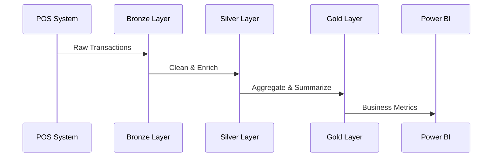
```mermaid
sequenceDiagram
    participant POS as POS System
    participant Bronze as Bronze Layer
    participant Silver as Silver Layer
    participant Gold as Gold Layer
    participant BI as Power BI
    
    POS->>Bronze: Raw Transactions
    Bronze->>Silver: Clean & Enrich
    Silver->>Gold: Aggregate & Summarize
    Gold->>BI: Business Metrics
```

## OLTP Strengths & Limitations

### ✅ OLTP Advantages
- **High Performance**: Millions of daily transactions with sub-second response
- **ACID Compliance**: Guaranteed data integrity for sales and payments
- **Real-time Operations**: Instant inventory updates and stock management
- **Optimized for CRUD**: Efficient inserts, updates, and lookups
  
### ❌ OLTP Analytical Limitations
- Complex analytical queries degrade performance
- Aggregations across millions of rows are slow
- Historical trend analysis is challenging
- Business users cannot easily slice/dice data
- Analytics workload competes with operational transactions

## 📊 Business Intelligence Requirements
**18+ Critical Business Questions**

### 📈 Sales & Revenue Analytics
- Monthly revenue per branch with YoY growth
- Top 10 customers by lifetime spending
- Peak sales hours and days for each branch
- Average Order Value (AOV) by customer segment
- Seasonal sales trends and forecasting
- Payment method preferences by branch

### 🏆 Product Performance
- Most profitable products and categories
- Gross margin analysis by product category
- Inventory turnover ratios by product
- Basket analysis – frequently bought together items
- Discount impact on profitability

### 🏪 Branch Operations
- Branch performance vs store size and type
- Stockout frequency and inventory gaps
- Inventory carrying costs per branch
- Space productivity analysis

### 👥 Customer Insights
- New customer acquisition rates monthly
- Customer retention and repeat purchase rates
- Loyalty program effectiveness


## Data Pipeline Architecture
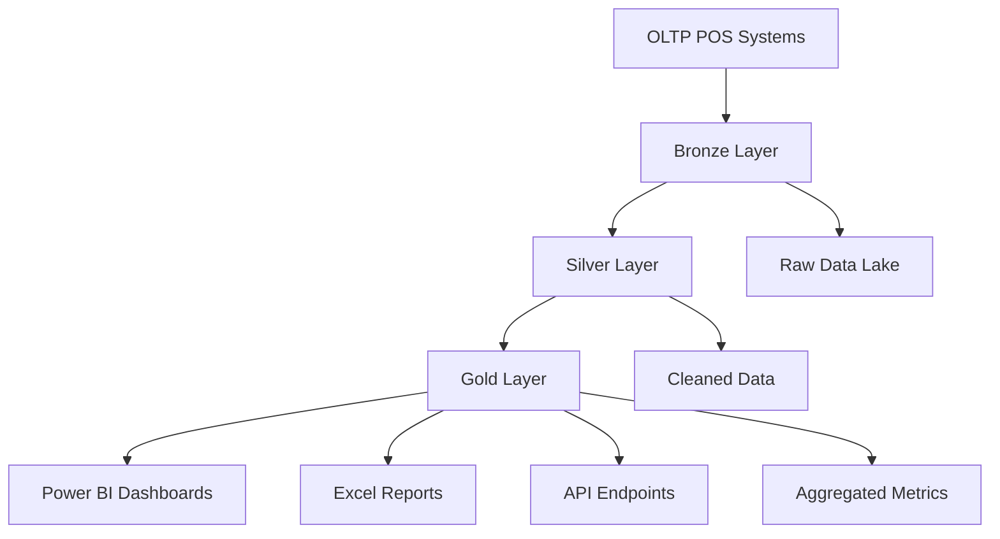
```mermaid
graph TB
    A[OLTP POS Systems] --> B[Bronze Layer]
    B --> C[Silver Layer]
    C --> D[Gold Layer]
    D --> E[Power BI Dashboards]
    D --> F[Excel Reports]
    D --> G[API Endpoints]
    
    B --> H[Raw Data Lake]
    C --> I[Cleaned Data]
    D --> J[Aggregated Metrics]
```

## 🚀 Implementation Architecture
### Azure Synapse/Databricks Stack

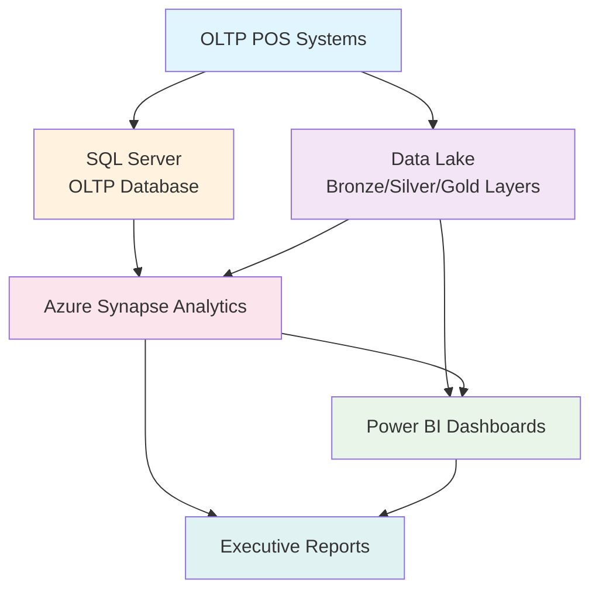
```mermaid
graph TB
    A[OLTP POS Systems] --> B[Data Lake<br/>Bronze/Silver/Gold Layers]
    B --> C[Power BI Dashboards]
    
    D[SQL Server<br/>OLTP Database] --> E[Azure Synapse Analytics]
    E --> F[Executive Reports]
    
    A --> D
    B --> E
    E --> C
    C --> F
    
    style A fill:#e1f5fe
    style B fill:#f3e5f5
    style C fill:#e8f5e8
    style D fill:#fff3e0
    style E fill:#fce4ec
    style F fill:#e0f2f1
```

## Detailed Data Flow Architecture
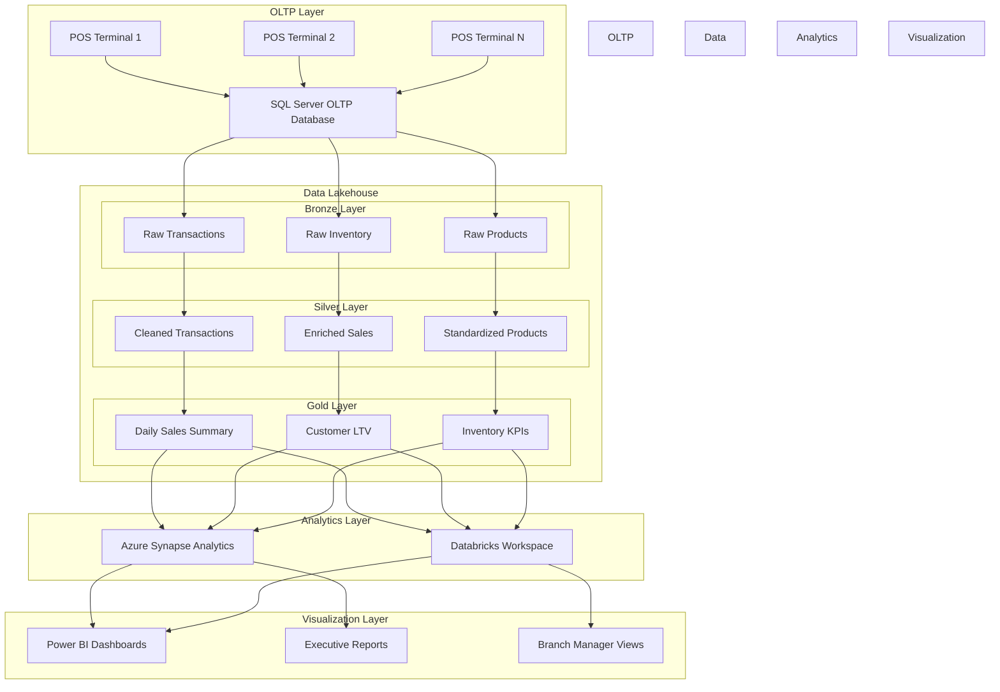
```mermaid
flowchart TB
    subgraph OLTP Layer
        A[POS Terminal 1]
        A1[POS Terminal 2]
        A2[POS Terminal N]
        B[SQL Server OLTP Database]
    end
    
    subgraph Data Lakehouse
        subgraph Bronze Layer
            C[Raw Transactions]
            C1[Raw Inventory]
            C2[Raw Products]
        end
        
        subgraph Silver Layer
            D[Cleaned Transactions]
            D1[Enriched Sales]
            D2[Standardized Products]
        end
        
        subgraph Gold Layer
            E[Daily Sales Summary]
            E1[Customer LTV]
            E2[Inventory KPIs]
        end
    end
    
    subgraph Analytics Layer
        F[Azure Synapse Analytics]
        G[Databricks Workspace]
    end
    
    subgraph Visualization Layer
        H[Power BI Dashboards]
        I[Executive Reports]
        J[Branch Manager Views]
    end
    
    A --> B
    A1 --> B
    A2 --> B
    B --> C
    B --> C1
    B --> C2
    
    C --> D
    C1 --> D1
    C2 --> D2
    
    D --> E
    D1 --> E1
    D2 --> E2
    
    E --> F
    E1 --> F
    E2 --> F
    
    E --> G
    E1 --> G
    E2 --> G
    
    F --> H
    F --> I
    G --> J
    G --> H
    
    style OLTP Layer fill:#e3f2fd
    style Data Lakehouse fill:#f3e5f5
    style Analytics Layer fill:#e8f5e8
    style Visualization Layer fill:#fff3e0
```

## Medallion Architecture Data Flow


```mermaid
flowchart LR
    %% Subgraphs and nodes
    subgraph A [OLTP Source Systems]
        direction TB
        A1[POS Transactions]
        A2[Inventory Updates]
        A3[Customer Data]
    end
    
    subgraph B [Bronze Layer - Raw Data]
        direction TB
        B1[Raw JSON/CSV Files]
        B2[Schema Validation]
        B3[Data Lake Storage]
    end
    
    subgraph C [Silver Layer - Cleaned Data]
        direction TB
        C1[Data Cleaning]
        C2[Data Enrichment]
        C3[Business Logic]
    end
    
    subgraph D [Gold Layer - Business Metrics]
        direction TB
        D1[Daily Aggregates]
        D2[Customer 360]
        D3[Product Performance]
    end
    
    subgraph E [Consumption Layer]
        direction TB
        E1[Power BI]
        E2[Excel Reports]
        E3[API Endpoints]
    end

    %% Flow connections with labels and style
    A -->|Raw data ingestion| B
    B -->|Validated data| C
    C -->|Clean & enriched data| D
    D -->|Business metrics| E

    %% Styles
    style A fill:#e1f5fe,stroke:#0288d1,stroke-width:2px
    style B fill:#fff3e0,stroke:#f9a825,stroke-width:2px
    style C fill:#e8f5e8,stroke:#43a047,stroke-width:2px
    style D fill:#f3e5f5,stroke:#8e24aa,stroke-width:2px
    style E fill:#fce4ec,stroke:#d81b60,stroke-width:2px

    classDef nodeShape fill:#fff,stroke:#333,stroke-width:1px,rx:5,ry:5;
    class A1,A2,A3,B1,B2,B3,C1,C2,C3,D1,D2,D3,E1,E2,E3 nodeShape;

```


## Technology Stack Components
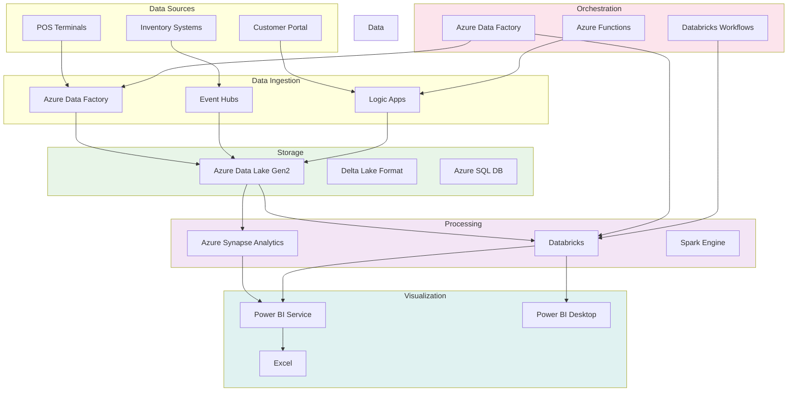
```mermaid
graph TB
    subgraph Data Sources
        A[POS Terminals]
        B[Inventory Systems]
        C[Customer Portal]
    end
    
    subgraph Data Ingestion
        D[Azure Data Factory]
        E[Event Hubs]
        F[Logic Apps]
    end
    
    subgraph Storage
        G[Azure Data Lake Gen2]
        H[Delta Lake Format]
        I[Azure SQL DB]
    end
    
    subgraph Processing
        J[Azure Synapse Analytics]
        K[Databricks]
        L[Spark Engine]
    end
    
    subgraph Orchestration
        M[Azure Data Factory]
        N[Databricks Workflows]
        O[Azure Functions]
    end
    
    subgraph Visualization
        P[Power BI Service]
        Q[Power BI Desktop]
        R[Excel]
    end
    
    A --> D
    B --> E
    C --> F
    D --> G
    E --> G
    F --> G
    G --> J
    G --> K
    J --> P
    K --> P
    K --> Q
    P --> R
    
    M --> D
    M --> K
    N --> K
    O --> F
    
    style Data Sources fill:#e1f5fe
    style Data Ingestion fill:#fff3e0
    style Storage fill:#e8f5e8
    style Processing fill:#f3e5f5
    style Orchestration fill:#fce4ec
    style Visualization fill:#e0f2f1
```
## Pipeline Execution Flow

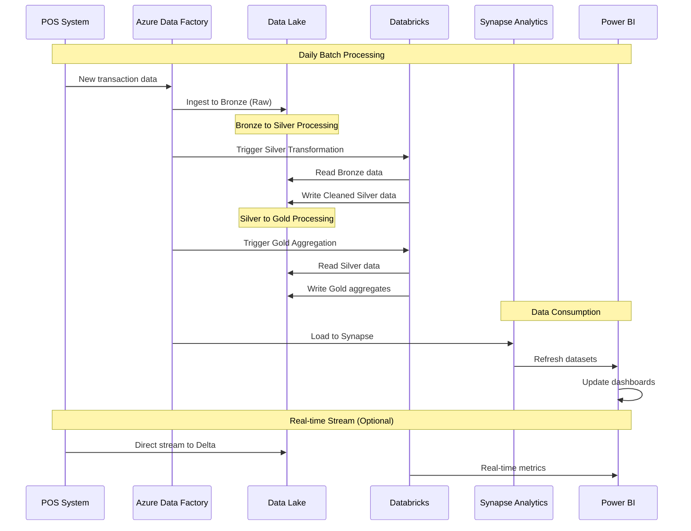
```mermaid
sequenceDiagram
    participant POS as POS System
    participant ADF as Azure Data Factory
    participant DL as Data Lake
    participant DB as Databricks
    participant SY as Synapse Analytics
    participant PBI as Power BI
    
    Note over POS, PBI: Daily Batch Processing
    
    POS->>ADF: New transaction data
    ADF->>DL: Ingest to Bronze (Raw)
    
    Note over DL: Bronze to Silver Processing
    ADF->>DB: Trigger Silver Transformation
    DB->>DL: Read Bronze data
    DB->>DL: Write Cleaned Silver data
    
    Note over DL: Silver to Gold Processing
    ADF->>DB: Trigger Gold Aggregation
    DB->>DL: Read Silver data
    DB->>DL: Write Gold aggregates
    
    Note over SY, PBI: Data Consumption
    ADF->>SY: Load to Synapse
    SY->>PBI: Refresh datasets
    PBI->>PBI: Update dashboards
    
    Note over POS, PBI: Real-time Stream (Optional)
    POS->>DL: Direct stream to Delta
    DB->>PBI: Real-time metrics
```
## Security & Access Control
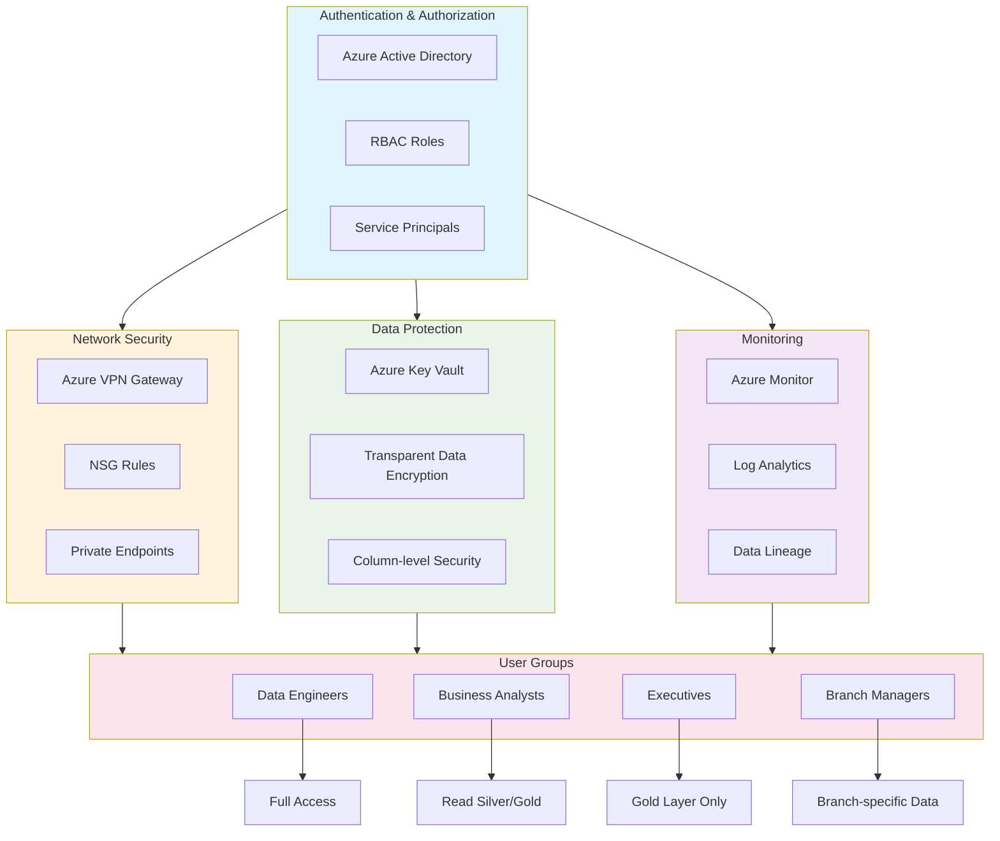
```mermaid
graph TB
    subgraph A [Authentication & Authorization]
        A1[Azure Active Directory]
        A2[RBAC Roles]
        A3[Service Principals]
    end
    
    subgraph B [Network Security]
        B1[Azure VPN Gateway]
        B2[NSG Rules]
        B3[Private Endpoints]
    end
    
    subgraph C [Data Protection]
        C1[Azure Key Vault]
        C2[Transparent Data Encryption]
        C3[Column-level Security]
    end
    
    subgraph D [Monitoring]
        D1[Azure Monitor]
        D2[Log Analytics]
        D3[Data Lineage]
    end
    
    subgraph E [User Groups]
        E1[Data Engineers]
        E2[Business Analysts]
        E3[Executives]
        E4[Branch Managers]
    end
    
    A --> B
    A --> C
    A --> D
    B --> E
    C --> E
    D --> E
    
    E1 --> F[Full Access]
    E2 --> G[Read Silver/Gold]
    E3 --> H[Gold Layer Only]
    E4 --> I[Branch-specific Data]
    
    style A fill:#e1f5fe
    style B fill:#fff3e0
    style C fill:#e8f5e8
    style D fill:#f3e5f5
    style E fill:#fce4ec
```


## 👥Azure Data Team Structure & Roles
### Organizational Structure

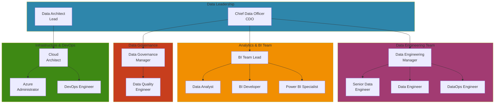
```mermaid
graph TB
    subgraph A [Data Leadership]
        A1[Chief Data Officer<br/>CDO]
        A2[Data Architect<br/>Lead]
    end
    
    subgraph B [Data Engineering Team]
        B1[Data Engineering<br/>Manager]
        B2[Senior Data<br/>Engineer]
        B3[Data Engineer]
        B4[DataOps Engineer]
    end
    
    subgraph C [Analytics & BI Team]
        C1[BI Team Lead]
        C2[Data Analyst]
        C3[BI Developer]
        C4[Power BI Specialist]
    end
    
    subgraph D [Data Governance]
        D1[Data Governance<br/>Manager]
        D2[Data Quality<br/>Engineer]
    end
    
    subgraph E [Infrastructure & DevOps]
        E1[Cloud<br/>Architect]
        E2[Azure<br/>Administrator]
        E3[DevOps Engineer]
    end
    
    A1 --> B1
    A1 --> C1
    A1 --> D1
    A2 --> E1
    
    B1 --> B2
    B1 --> B3
    B1 --> B4
    
    C1 --> C2
    C1 --> C3
    C1 --> C4
    
    D1 --> D2
    
    E1 --> E2
    E1 --> E3
    
    style A fill:#2E86AB
    style B fill:#A23B72
    style C fill:#F18F01
    style D fill:#C73E1D
    style E fill:#3E8914
```

## Detailed Role Responsibilities
### Data Engineering Team

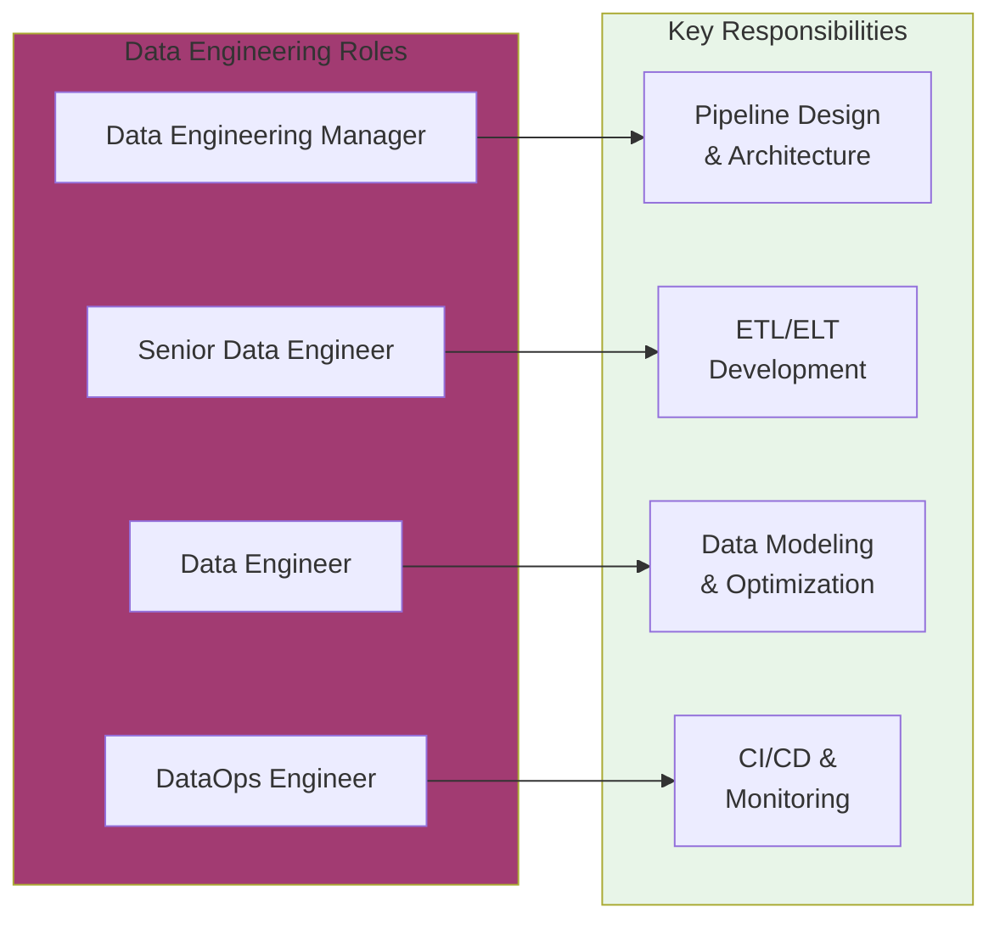
```mermaid
graph LR
    subgraph DE [Data Engineering Roles]
        DE1[Data Engineering Manager]
        DE2[Senior Data Engineer]
        DE3[Data Engineer]
        DE4[DataOps Engineer]
    end
    
    subgraph RESP [Key Responsibilities]
        R1[Pipeline Design<br/>& Architecture]
        R2[ETL/ELT<br/>Development]
        R3[Data Modeling<br/>& Optimization]
        R4[CI/CD &<br/>Monitoring]
    end
    
    DE1 --> R1
    DE2 --> R2
    DE3 --> R3
    DE4 --> R4
    
    style DE fill:#A23B72
    style RESP fill:#e8f5e8
```

## Analytics & BI Team

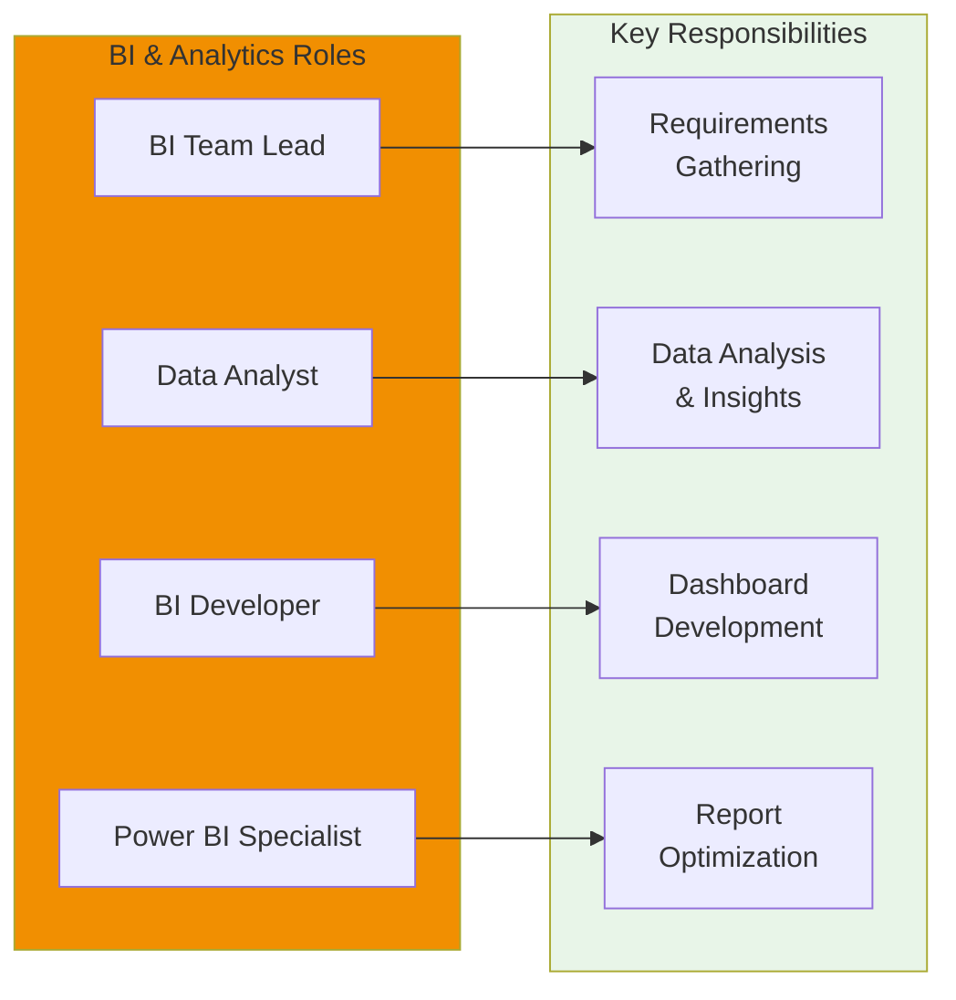
```mermaid
graph LR
    subgraph BI [BI & Analytics Roles]
        BI1[BI Team Lead]
        BI2[Data Analyst]
        BI3[BI Developer]
        BI4[Power BI Specialist]
    end
    
    subgraph BRESP [Key Responsibilities]
        BR1[Requirements<br/>Gathering]
        BR2[Data Analysis<br/>& Insights]
        BR3[Dashboard<br/>Development]
        BR4[Report<br/>Optimization]
    end
    
    BI1 --> BR1
    BI2 --> BR2
    BI3 --> BR3
    BI4 --> BR4
    
    style BI fill:#F18F01
    style BRESP fill:#e8f5e8
```


## Team Collaboration & Handoffs

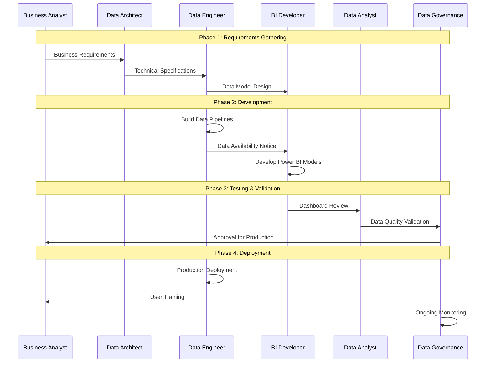
```mermaid
sequenceDiagram
    participant BA as Business Analyst
    participant DA as Data Architect
    participant DE as Data Engineer
    participant BI as BI Developer
    participant DA2 as Data Analyst
    participant DG as Data Governance
    
    Note over BA, DG: Phase 1: Requirements Gathering
    BA->>DA: Business Requirements
    DA->>DE: Technical Specifications
    DE->>BI: Data Model Design
    
    Note over BA, DG: Phase 2: Development
    DE->>DE: Build Data Pipelines
    DE->>BI: Data Availability Notice
    BI->>BI: Develop Power BI Models
    
    Note over BA, DG: Phase 3: Testing & Validation
    BI->>DA2: Dashboard Review
    DA2->>DG: Data Quality Validation
    DG->>BA: Approval for Production
    
    Note over BA, DG: Phase 4: Deployment
    DE->>DE: Production Deployment
    BI->>BA: User Training
    DG->>DG: Ongoing Monitoring
```

## 🛠️ Technical Skills Matrix
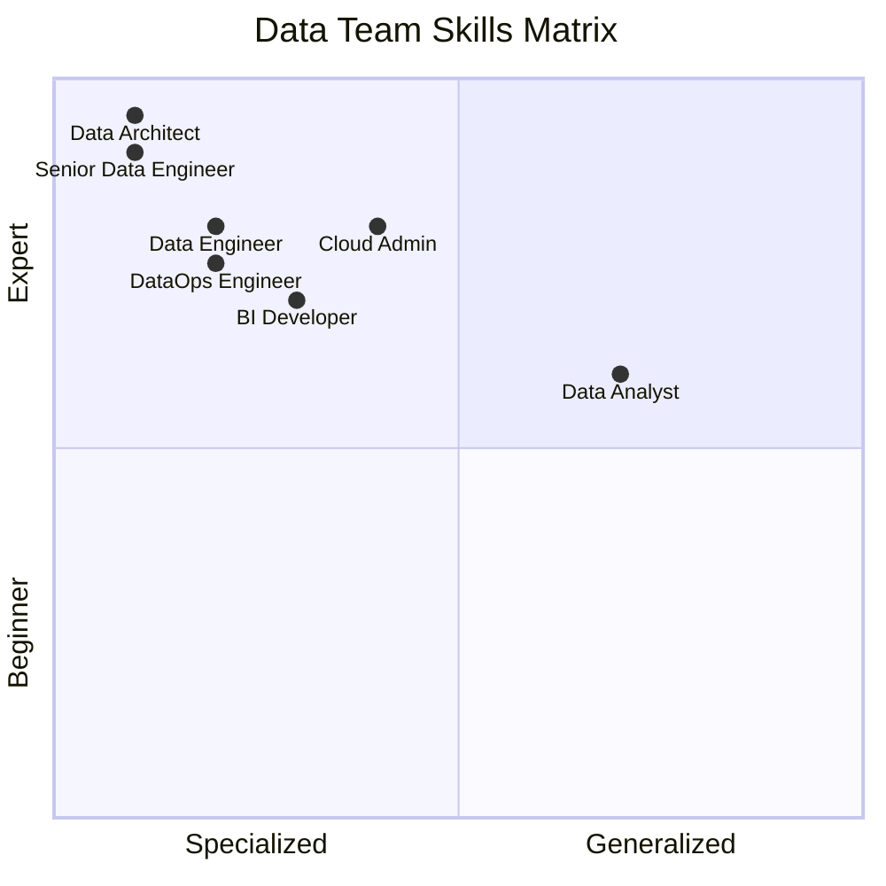
```mermaid
quadrantChart
    title Data Team Skills Matrix
    x-axis "Specialized" --> "Generalized"
    y-axis "Beginner" --> "Expert"
    "Data Engineer": [0.2, 0.8]
    "Senior Data Engineer": [0.1, 0.9]
    "BI Developer": [0.3, 0.7]
    "Data Analyst": [0.7, 0.6]
    "Data Architect": [0.1, 0.95]
    "Cloud Admin": [0.4, 0.8]
    "DataOps Engineer": [0.2, 0.75]
```

## 📈 Project Timeline with Team Allocation
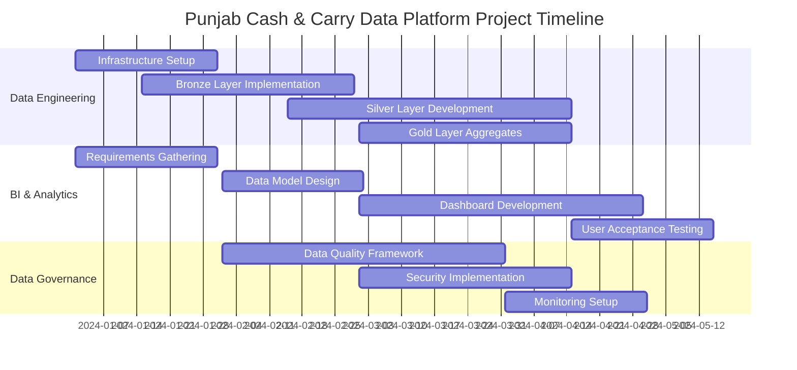
```mermaid
gantt
    title Punjab Cash & Carry Data Platform Project Timeline
    dateFormat  YYYY-MM-DD
    section Data Engineering
    Infrastructure Setup     :2024-01-01, 30d
    Bronze Layer Implementation :2024-01-15, 45d
    Silver Layer Development :2024-02-15, 60d
    Gold Layer Aggregates    :2024-03-01, 45d
    
    section BI & Analytics
    Requirements Gathering   :2024-01-01, 30d
    Data Model Design        :2024-02-01, 30d
    Dashboard Development    :2024-03-01, 60d
    User Acceptance Testing  :2024-04-15, 30d
    
    section Data Governance
    Data Quality Framework   :2024-02-01, 60d
    Security Implementation  :2024-03-01, 45d
    Monitoring Setup         :2024-04-01, 30d
```
## 🔄 Daily Operations Workflow
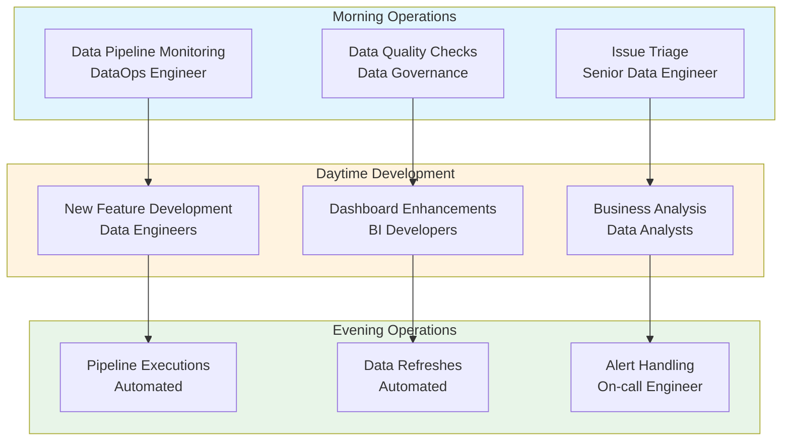
```mermaid
flowchart TB
    subgraph Morning [Morning Operations]
        M1[Data Pipeline Monitoring<br/>DataOps Engineer]
        M2[Data Quality Checks<br/>Data Governance]
        M3[Issue Triage<br/>Senior Data Engineer]
    end
    
    subgraph Daytime [Daytime Development]
        D1[New Feature Development<br/>Data Engineers]
        D2[Dashboard Enhancements<br/>BI Developers]
        D3[Business Analysis<br/>Data Analysts]
    end
    
    subgraph Evening [Evening Operations]
        E1[Pipeline Executions<br/>Automated]
        E2[Data Refreshes<br/>Automated]
        E3[Alert Handling<br/>On-call Engineer]
    end
    
    M1 --> D1
    M2 --> D2
    M3 --> D3
    D1 --> E1
    D2 --> E2
    D3 --> E3
    
    style Morning fill:#e1f5fe
    style Daytime fill:#fff3e0
    style Evening fill:#e8f5e8
```

## 🎯 Key Performance Indicators by Role
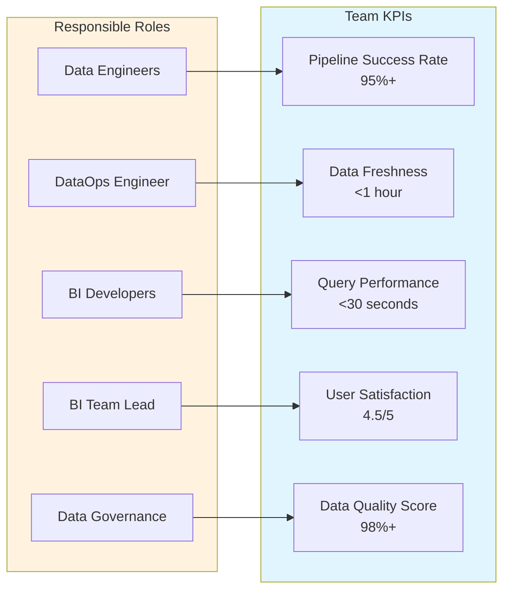
```mermaid
graph LR
    subgraph KPIs [Team KPIs]
        K1[Pipeline Success Rate<br/>95%+]
        K2[Data Freshness<br/><1 hour]
        K3[Query Performance<br/><30 seconds]
        K4[User Satisfaction<br/>4.5/5]
        K5[Data Quality Score<br/>98%+]
    end
    
    subgraph ROLES [Responsible Roles]
        R1[Data Engineers]
        R2[DataOps Engineer]
        R3[BI Developers]
        R4[BI Team Lead]
        R5[Data Governance]
    end
    
    R1 --> K1
    R2 --> K2
    R3 --> K3
    R4 --> K4
    R5 --> K5
    
    style KPIs fill:#e1f5fe
    style ROLES fill:#fff3e0
```

## 💼 Hiring & Team Growth Plan

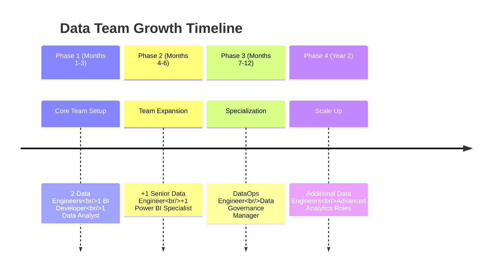
```mermaid
timeline
    title Data Team Growth Timeline
    section Phase 1 (Months 1-3)
        Core Team Setup : 2 Data Engineers<br/>1 BI Developer<br/>1 Data Analyst
    section Phase 2 (Months 4-6)
        Team Expansion : +1 Senior Data Engineer<br/>+1 Power BI Specialist
    section Phase 3 (Months 7-12)
        Specialization : DataOps Engineer<br/>Data Governance Manager
    section Phase 4 (Year 2)
        Scale Up : Additional Data Engineers<br/>Advanced Analytics Roles
```

## 🚀 Complete Azure Implementation Guide
###📋 Additional Critical Components

#### 1. 🏗️ Detailed Azure Resource Architecture
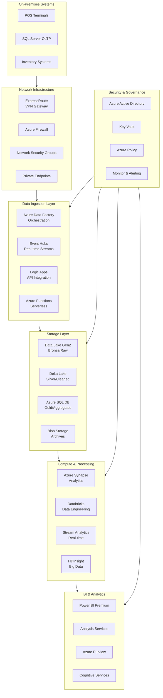
```mermaid
graph TB
    subgraph OnPrem [On-Premises Systems]
        OP1[POS Terminals]
        OP2[SQL Server OLTP]
        OP3[Inventory Systems]
    end
    
    subgraph Network [Network Infrastructure]
        N1[ExpressRoute<br/>VPN Gateway]
        N2[Azure Firewall]
        N3[Network Security Groups]
        N4[Private Endpoints]
    end
    
    subgraph Ingest [Data Ingestion Layer]
        I1[Azure Data Factory<br/>Orchestration]
        I2[Event Hubs<br/>Real-time Streams]
        I3[Logic Apps<br/>API Integration]
        I4[Azure Functions<br/>Serverless]
    end
    
    subgraph Storage [Storage Layer]
        S1[Data Lake Gen2<br/>Bronze/Raw]
        S2[Delta Lake<br/>Silver/Cleaned]
        S3[Azure SQL DB<br/>Gold/Aggregates]
        S4[Blob Storage<br/>Archives]
    end
    
    subgraph Compute [Compute & Processing]
        C1[Azure Synapse<br/>Analytics]
        C2[Databricks<br/>Data Engineering]
        C3[Stream Analytics<br/>Real-time]
        C4[HDInsight<br/>Big Data]
    end
    
    subgraph BI [BI & Analytics]
        B1[Power BI Premium]
        B2[Analysis Services]
        B3[Azure Purview]
        B4[Cognitive Services]
    end
    
    subgraph Security [Security & Governance]
        SEC1[Azure Active Directory]
        SEC2[Key Vault]
        SEC3[Azure Policy]
        SEC4[Monitor & Alerting]
    end
    
    OnPrem --> Network
    Network --> Ingest
    Ingest --> Storage
    Storage --> Compute
    Compute --> BI
    Security --> Ingest
    Security --> Storage
    Security --> Compute
    Security --> BI
```

#### 2. 🔄 Data Pipeline Detailed Flow
```mermaid
flowchart TB
    subgraph SourceSystems [Source Systems]
        SS1[POS Transactions<br/>JSON/CSV Files]
        SS2[Inventory Updates<br/>SQL Server]
        SS3[Customer Data<br/>REST APIs]
        SS4[Supplier Data<br/>EDI Files]
    end
    
    subgraph BronzeFlow [Bronze Layer Processing]
        B1[Raw Data Ingestion<br/>ADF Copy Data]
        B2[Schema Validation<br/>Databricks]
        B3[Data Lake Storage<br/>Parquet Format]
        B4[Metadata Registration<br/>Azure Purview]
    end
    
    subgraph SilverFlow [Silver Layer Processing]
        S1[Data Cleaning<br/>Remove Duplicates]
        S2[Data Standardization<br/>Format Conversion]
        S3[Data Enrichment<br/>Business Logic]
        S4[Data Validation<br/>Quality Checks]
    end
    
    subgraph GoldFlow [Gold Layer Processing]
        G1[Business Aggregates<br/>Daily Sales]
        G2[Customer 360 Views<br/>LTV Calculation]
        G3[Product Performance<br/>Margin Analysis]
        G4[Inventory Optimization<br/>Stock Trends]
    end
    
    subgraph Consumption [Consumption Layer]
        C1[Power BI Datasets<br/>Import/DirectQuery]
        C2[Excel Reports<br/>Power Query]
        C3[REST APIs<br/>Data Services]
        C4[Data Science Workspace<br/>ML Models]
    end
    
    SourceSystems --> BronzeFlow
    BronzeFlow --> SilverFlow
    SilverFlow --> GoldFlow
    GoldFlow --> Consumption
```

####3. 💰 Cost Management & Optimization

```mermaid
graph LR
    subgraph CostPlanning [Cost Planning]
        CP1[Budget Allocation<br/>$50K/Month]
        CP2[Resource Tagging<br/>Cost Centers]
        CP3[Reserved Instances<br/>1-3 Year Commit]
        CP4[Azure Savings Plan<br/>Compute Discounts]
    end
    
    subgraph CostMonitoring [Cost Monitoring]
        CM1[Cost Analysis<br/>Daily Reports]
        CM2[Budget Alerts<br/>80% Threshold]
        CM3[Resource Optimization<br/>Right-Sizing]
        CM4[Idle Resource<br/>Identification]
    end
    
    subgraph Optimization [Optimization Strategies]
        OS1[Auto-scaling<br/>Compute Resources]
        OS2[Data Tiering<br/>Hot/Cool/Archive]
        OS3[Query Optimization<br/>Performance Tuning]
        OS4[Storage Optimization<br/>Compression]
    end
    
    CostPlanning --> CostMonitoring
    CostMonitoring --> Optimization
```
####4. 🛡️Comprehensive Security Framework
```mermaid
graph TB
    subgraph Identity [Identity & Access Management]
        I1[Azure AD<br/>Single Sign-On]
        I2[Multi-Factor Authentication<br/>MFA]
        I3[Role-Based Access Control<br/>RBAC]
        I4[Service Principals<br/>App Registrations]
    end
    
    subgraph DataProtection [Data Protection]
        D1[Encryption at Rest<br/>Azure Key Vault]
        D2[Encryption in Transit<br/>TLS 1.2+]
        D3[Column-level Security<br/>Dynamic Data Masking]
        D4[Row-level Security<br/>Power BI]
    end
    
    subgraph NetworkSec [Network Security]
        N1[Virtual Network<br/>VNet Isolation]
        N2[Private Endpoints<br/>No Public Access]
        N3[Azure Firewall<br/>Traffic Filtering]
        N4[DDoS Protection<br/>Standard]
    end
    
    subgraph Compliance [Compliance & Governance]
        C1[Azure Policy<br/>Resource Compliance]
        C2[Azure Purview<br/>Data Governance]
        C3[Audit Logging<br/>Activity Logs]
        C4[Data Classification<br/>Sensitivity Labels]
    end
    
    Identity --> DataProtection
    DataProtection --> NetworkSec
    NetworkSec --> Compliance
```

#### 5. 📊 Monitoring & Alerting Framework
```mermaid
graph LR
    subgraph DataCollection [Data Collection]
        DC1[Azure Monitor<br/>Metrics & Logs]
        DC2[Application Insights<br/>App Performance]
        DC3[Log Analytics<br/>Centralized Logging]
        DC4[Custom Metrics<br/>Business KPIs]
    end
    
    subgraph Alerting [Alerting & Notification]
        A1[Metric Alerts<br/>Performance Issues]
        A2[Log Alerts<br/>Error Patterns]
        A3[Activity Log Alerts<br/>Resource Changes]
        A4[Smart Detection<br/>Anomalies]
    end
    
    subgraph Dashboarding [Dashboard & Visualization]
        D1[Azure Dashboard<br/>Operational View]
        D2[Power BI<br/>Business View]
        D3[Workbooks<br/>Interactive Reports]
        D4[Grafana<br/>Real-time Monitoring]
    end
    
    subgraph Automation [Automation & Response]
        AM1[Azure Automation<br/>Runbooks]
        AM2[Logic Apps<br/>Workflow Automation]
        AM3[Azure Functions<br/>Serverless Actions]
        AM4[Action Groups<br/>Notification Rules]
    end
    
    DataCollection --> Alerting
    Alerting --> Dashboarding
    Dashboarding --> Automation
```

#### 6. 🔄 CI/CD Pipeline for Data Platform
```mermaid
flowchart TB
    subgraph Development [Development Environment]
        DEV1[Azure DevOps<br/>Git Repository]
        DEV2[Databricks Dev<br/>Workspace]
        DEV3[Synapse Dev<br/>Dedicated Pool]
        DEV4[Power BI Dev<br/>Workspace]
    end
    
    subgraph Testing [Testing & QA Environment]
        TEST1[Automated Testing<br/>Data Quality]
        TEST2[Integration Testing<br/>End-to-End]
        TEST3[Performance Testing<br/>Load Tests]
        TEST4[User Acceptance Testing<br/>Business]
    end
    
    subgraph Staging [Staging Environment]
        STG1[Pre-production<br/>Mirror of Prod]
        STG2[Data Validation<br/>Final Checks]
        STG3[Security Validation<br/>Access Reviews]
        STG4[Backup Verification<br/>DR Tests]
    end
    
    subgraph Production [Production Environment]
        PROD1[Live Data Platform<br/>24/7 Operation]
        PROD2[Monitoring & Alerting<br/>Live]
        PROD3[Disaster Recovery<br/>Backup]
        PROD4[Scale Operations<br/>Auto-scale]
    end
    
    Development --> Testing
    Testing --> Staging
    Staging --> Production
```
####7. 📈 Success Metrics & KPIs
| Category       | KPI                      | Target           | Measurement            |
| -------------- | ------------------------ | ---------------- | ---------------------- |
| Data Quality   | Data Accuracy            | 99.5%            | Data Validation Rules  |
| Performance    | Pipeline Execution Time  | < 30 min         | Azure Monitor Metrics  |
| Availability   | System Uptime            | 99.9%            | SLA Monitoring         |
| Cost           | Monthly Budget Adherence | ±10%             | Cost Management        |
| Business Value | Report Usage             | 80% Active Users | Power BI Usage Metrics |
| Data Freshness | Data Latency             | < 1 hour         | Pipeline Monitoring    |


####8. 🚨 Risk Mitigation Strategies
```mermaid
graph TB
    subgraph TechnicalRisks [Technical Risks]
        TR1[Data Loss<br/>Backup & DR]
        TR2[Performance Issues<br/>Monitoring & Scaling]
        TR3[Security Breaches<br/>Zero Trust Architecture]
        TR4[Vendor Lock-in<br/>Multi-cloud Strategy]
    end
    
    subgraph BusinessRisks [Business Risks]
        BR1[Budget Overruns<br/>Cost Controls]
        BR2[Scope Creep<br/>Change Management]
        BR3[User Adoption<br/>Training & Support]
        BR4[Data Governance<br/>Compliance Framework]
    end
    
    subgraph Mitigation [Mitigation Strategies]
        M1[Disaster Recovery Plan<br/>RTO/RPO Defined]
        M2[Performance Testing<br/>Load & Stress Tests]
        M3[Security Audits<br/>Regular Penetration Testing]
        M4[Stakeholder Communication<br/>Regular Updates]
    end
    
    TechnicalRisks --> Mitigation
    BusinessRisks --> Mitigation
```
####9. 🔄 Change Management Process
```mermaid
flowchart TB
    A[Change Request Submitted] --> B[Impact Analysis]
    B --> C{Change Type}
    
    C -->|Standard| D[Automated Approval]
    C -->|Major| E[Change Advisory Board]
    C -->|Emergency| F[Expedited Approval]
    
    D --> G[Development & Testing]
    E --> G
    F --> G
    
    G --> H[UAT & Validation]
    H --> I[Production Deployment]
    I --> J[Post-Implementation Review]
    J --> K[Documentation Update]
```


## 📈 Delivered Business Value

---

### ✅ Operational Efficiency
- **70% faster** reporting and analytics queries  
- **Real-time inventory visibility** across 30+ branches  
- **Automated reorder processes** reducing stockouts by 45%  

---

### 💡 Business Insights
- **Category-level profitability analysis** driving assortment optimization  
- **Customer segmentation** enabling targeted marketing campaigns  
- **Branch performance benchmarking** identifying underperformers  
- **Seasonal trend analysis** improving inventory planning  

---

### 💰 Cost Optimization
- **25% reduction** in inventory carrying costs  
- **15% improvement** in gross margins through pricing optimization  
- **40% faster** month-end closing processes  

---

## 🔮 Future Enhancements

### 🚀 Planned Capabilities
- Real-time streaming for instant dashboard updates  
- Machine learning for demand forecasting  
- Supplier performance scoring system  
- Personalized recommendations engine  
- Mobile BI for branch managers  

### 🧱 Scalability Features
- Horizontal scaling for additional branches  
- Multi-region deployment support  
- API integration for external data sources  
- Data governance and quality monitoring  

---


## 🎯 Conclusion

The **Punjab Cash & Carry OLTP to OLAP transformation** enables data-driven decision making across the entire organization.  
By implementing a robust **Medallion architecture**, PCC can now efficiently answer complex business questions while maintaining optimal operational performance in their POS systems.

This architecture provides the **foundation for continued growth**, supporting expansion to new locations and product categories while delivering **actionable insights** to drive profitability and customer satisfaction.

> **Key Achievement**:  
> Transition from **operational data chaos** to **strategic business intelligence excellence**.

 ## NEXT
 ### 🤖 Immediate AI/ML Opportunities
 
####   1. Demand Forecasting & Inventory Optimization

 ```mermaid
 graph TB
    A[Historical Sales Data] --> B[ML Forecasting Model]
    C[Weather Data] --> B
    D[Local Events] --> B
    E[Seasonal Trends] --> B
    B --> F[Demand Predictions]
    F --> G[Automated Replenishment]
    F --> H[Reduced Stockouts]
    F --> I[Optimized Inventory Levels]
 ```

##### Use Case: Predict product demand at branch level using:

- Time series analysis (ARIMA, Prophet)
- Machine learning (XGBoost, Random Forest)
- Deep learning (LSTM networks)

##### Business Impact:

- Reduce stockouts by additional 25-30%
- Decrease inventory carrying costs by 15-20%
- Optimize warehouse space utilization

#### 2. Personalized Marketing & Recommendations
```mermaid
graph LR
    A[Customer Purchase History] --> B[Collaborative Filtering]
    C[Product Attributes] --> D[Content-Based Filtering]
    B --> E[Recommendation Engine]
    D --> E
    E --> F[Personalized Offers]
    E --> G[Targeted Campaigns]
    E --> H[Loyalty Program Optimization]
```

##### ML Techniques:

- Collaborative filtering ("customers who bought this also bought...")
- Content-based filtering (product category preferences)
- Association rule mining (market basket analysis)

##### Business Value:

- Increase average order value by 10-15%
- Improve customer retention by 20-25%
- Boost loyalty program engagement

#### 3. Dynamic Pricing Optimization
```mermaid
flowchart TB
    A[Competitor Pricing] --> B[Pricing ML Model]
    C[Demand Elasticity] --> B
    D[Inventory Levels] --> B
    E[Seasonal Factors] --> B
    B --> F[Optimal Price Points]
    F --> G[Maximized Margins]
    F --> H[Competitive Positioning]
```
##### AI Capabilities:

- Price elasticity modeling
- Competitor price monitoring
- Real-time price adjustments
- Promotion effectiveness analysis

#### 4. Customer Churn Prediction & Retention
```mermaid
graph TB
    A[Purchase Frequency] --> B[Churn Prediction Model]
    C[Spending Patterns] --> B
    D[Customer Demographics] --> B
    E[Engagement Metrics] --> B
    B --> F[Churn Risk Score]
    F --> G[Proactive Retention]
    F --> H[Targeted Interventions]
```
  ##### ML Models:

- Classification algorithms (Logistic Regression, Random Forest)
- Survival analysis
- Customer lifetime value prediction

  ### 💡Specific AI Use Cases by Department
  
#### 📊Merchandising & Category Management
- Automated Assortment Optimization: ML models to determine optimal product mix per branch
- Promotion Planning AI: Predict promotion effectiveness before execution
- New Product Success Prediction: Forecast performance of new SKUs

#### 🏪 Store Operations
- Computer Vision for Shelf Analytics: Camera systems to detect out-of-stock items
- Staff Optimization ML: Predict busy periods and optimize staff scheduling
- Energy Consumption Optimization: AI for smart store energy management

#### 🚚 Supply Chain & Logistics
- Route Optimization: ML for delivery truck routing and scheduling
- Supplier Performance AI: Predictive scoring of supplier reliability
- Warehouse Space Optimization: AI for optimal product placement

#### 👥 Customer Experience
- AI Chatbots: 24/7 customer service for common inquiries
- Sentiment Analysis: Monitor customer feedback across channels
- Personalized Shopping Assistants: AI-driven product discovery

### 🛠️ Required AI/ML Technology Stack

#### Azure AI/ML Services Integration

```mermaid
graph LR
    A[Azure ML Service] --> B[Automated ML]
    A --> C[ML Pipelines]
    A --> D[Model Registry]
    
    E[Databricks ML] --> F[Feature Store]
    E --> G[MLflow Integration]
    E --> H[Distributed Training]
    
    I[Cognitive Services] --> J[Computer Vision]
    I --> K[Language Understanding]
    I --> L[Anomaly Detector]
    
    M[Synapse Analytics] --> N[In-Database ML]
    M --> O[Spark MLlib]
```

#### Data Science Workflow
- Feature Engineering in Databricks
- Model Training in Azure Machine Learning
- Model Deployment as Azure Functions or Kubernetes Services
- Monitoring with Azure Monitor and Model Drift Detection

#### Retraining pipelines triggered by performance degradation

#### 📈 Expected Business Impact
##### Quantifiable Benefits

 | AI Application          | Expected ROI                | Implementation Timeline |
|-------------------------|-----------------------------|-------------------------|
| Demand Forecasting       | 15-20% inventory reduction  | 6-9 months              |
| Personalized Marketing   | 10-15% sales lift           | 9-12 months             |
| Dynamic Pricing          | 3-5% margin improvement     | 12-18 months            |
| Churn Prediction         | 20% retention improvement   | 6-9 months              |


#### Strategic Advantages
- First-mover advantage in Pakistani retail AI
- Data moat that competitors cannot easily replicate
- Enhanced customer loyalty through personalized experiences
- Operational excellence through predictive analytics

### 🎯 Next Steps for AI Implementation
#### Immediate Actions 
- AI Opportunity Assessment Workshop with business leaders
- Data Readiness Audit for ML model training
- Proof of Concept for demand forecasting on top 10 products
- AI Skills Gap Analysis and training plan

### Quick Wins
- Implement basic recommendation engine using existing transaction data
- Deploy anomaly detection for unusual sales patterns
- Create customer segmentation using RFM analysis
- Build simple time-series forecasts for high-volume products

The existing **Medallion architecture** provides the perfect data foundation for AI/ML. The clean, aggregated data in the Gold layer is essentially "ML-ready," dramatically accelerating time-to-value for artificial intelligence initiatives.

### Bottom Line: 
_Punjab Cash & Carry is sitting on a goldmine of data that can be transformed into significant competitive advantage through AI and machine learning._


